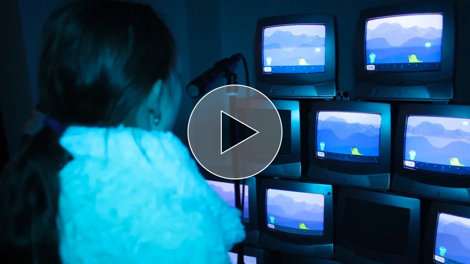
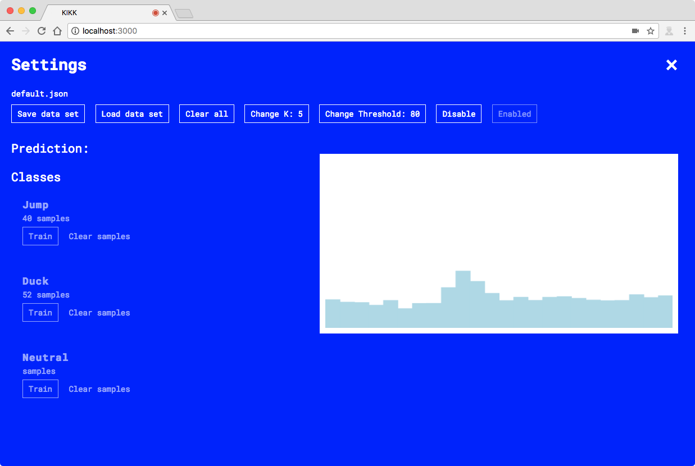

# Sound Controlled Intergalactic Teddy

#### Avoiding space monsters with sounds

[_Sound Controlled Intergalactic Teddy_](https://vimeo.com/241871305) is an infinite runner game where you use your voice and sounds to control Teddy’s movements. If you need to jump over a green slimy alien you say “Ohhh” and to duck you simply clap your hands.

Using machine learning we have taught the game to understand and differentiate the sounds. For the game to be able to recognise and distinguish the sounds, we trained it by recording a lot of diverse _"ohhh”s_ and _claps_ which made it robust and easy for anyone to play.

The installation was displayed in Namur, Belgium at [KIKK Festival 2017](https://www.kikk.be/2017/) as a part of [Little.KIKK](https://www.kikk.be/2017/en/little-kikk).

__[Støj](http://stoj.io)__ is a creative coding studio run by ([Andreas Refsgaard](http://andreasrefsgaard.dk) & [Lasse Korsgaard](http://lassekorsgaard.com))

__Game graphics__: [Amalie Kvistgaard](http://amaliekvistgaard.dk)

## Demo
You can play the game here: [demo](https://stoj-kikk.surge.sh/) (Make sure to allow microphone)

## Installation
To install, clone this repository and then run `yarn` in Terminal. This will install all the dependencies. Once these are installed, run `yarn watch` - this will start a local server on your machine and open up the page in your browser and you're ready to play!

Be sure to allow the browser to use the microphone, otherwise it will not work. Also be aware that due to browser safety issues, this will only work on `localhost` and `https://` domains.

## Usage
As per default the machine is trained on _Ohhh_ and _Clap_ sounds. 
If you would like to train it to recognize new sounds you can open up the training interface.

To open the training interface simply hit `Shift + TAB` on your keyboard. 

### Settings
In the training interface you can load, save and reset training data. You can also control the threshold for how sensitive the microphone should be. if you are attempting to record some new training examples, but find that nothing happens, it could be because the `threshold` is too high. Click `Change Threshold` and set it to a lower number and try again. If the sound is loud enough the sound bars on the right will turn blue.

### Training
You can clear all training data by clicking `Clear All`. 

Now say you want to train the sound that should trigger a jump. Click and hold down the `Train` button under _Jump_ and say the sound a few times (around  10-20 samples should be sufficient). Make sure the sound you're making is short and loud enough for the sound bars to turn completely blue, otherwise the sound is not recorded. 

## License

The MIT License (MIT)

> Copyright 2017 [Støj](http://stoj.io)
> 
> Permission is hereby granted, free of charge, to any person obtaining a copy of this software and associated documentation files (the "Software"), to deal in the Software without restriction, including without limitation the rights to use, copy, modify, merge, publish, distribute, sublicense, and/or sell copies of the Software, and to permit persons to whom the Software is furnished to do so, subject to the following conditions:
> 
> The above copyright notice and this permission notice shall be included in all copies or substantial portions of the Software.
> 
> THE SOFTWARE IS PROVIDED "AS IS", WITHOUT WARRANTY OF ANY KIND, EXPRESS OR IMPLIED, INCLUDING BUT NOT LIMITED TO THE WARRANTIES OF MERCHANTABILITY, FITNESS FOR A PARTICULAR PURPOSE AND NONINFRINGEMENT. IN NO EVENT SHALL THE AUTHORS OR COPYRIGHT HOLDERS BE LIABLE FOR ANY CLAIM, DAMAGES OR OTHER LIABILITY, WHETHER IN AN ACTION OF CONTRACT, TORT OR OTHERWISE, ARISING FROM, OUT OF OR IN CONNECTION WITH THE SOFTWARE OR THE USE OR OTHER DEALINGS IN THE SOFTWARE.

Sound Controlled Intergalactic Teddy makes use of the following libraries:

- [__KNear__](https://github.com/NathanEpstein/KNear) by [Nathan Epstein](https://github.com/NathanEpstein). 
  - License: MIT. Copyright (c) 2014 Nathan Epstein
- [__meyda__](https://github.com/meyda/meyda) by [hughrawlinson](https://github.com/hughrawlinson), [nevosegal](https://github.com/nevosegal), [jakubfiala](https://github.com/jakubfiala) & [2xAA](https://github.com/2xaa)
  - License: MIT.  Copyright (c) 2014 Hugh A. Rawlinson, Nevo Segal, Jakub Fiala